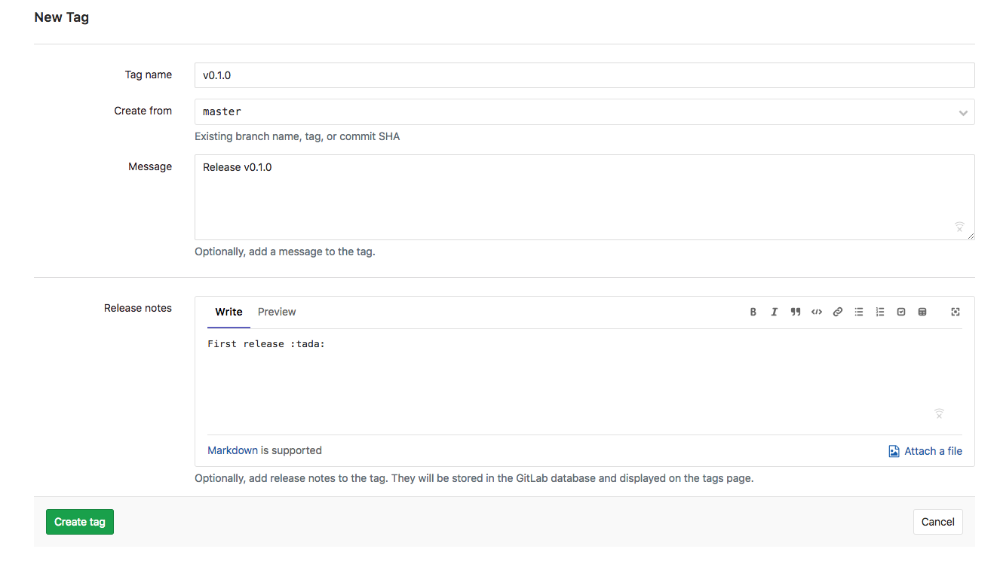

# Hosting on GitLab

- Add and commit everything:

    ```console
    $ git add -A && git commit -am "shard complete"
    ```

- Create a GitLab project with the same `name` and `description` as specified in your `shard.yml`.

- Add the remote: (Be sure to replace `<YOUR-GITLAB-USERNAME>` and `<YOUR-REPOSITORY-NAME>` accordingly)

    ```console
    $ git remote add origin https://gitlab.com/<YOUR-GITLAB-USERNAME>/<YOUR-REPOSITORY-NAME>.git
    ```

    or if you use SSH

    ```console
    $ git remote add origin git@gitlab.com:<YOUR-GITLAB-USERNAME>/<YOUR-REPOSITORY-NAME>.git
    ```

- Push it:

    ```console
    $ git push origin master
    ```

## Pipelines

Next, let's setup a [GitLab Pipeline](https://docs.gitlab.com/ee/ci/pipelines.html) that can run our tests and build/deploy the docs when we push code to the repo.

Simply, you can just add the following file to the root of the repo and name it `.gitlab-ci.yml`

```yaml
image: "crystallang/crystal:latest"

before_script:
  - shards install

cache:
  paths:
  - lib/

spec & format:
  script:
  - crystal spec
  - crystal tool format --check

pages:
  stage: deploy
  script:
  - crystal docs -o public src/palindrome-example.cr
  artifacts:
    paths:
    - public
  only:
  - master
```

This creates two jobs. The first one is titled "spec & format" (you can use any name you like) and by default goes in the "test" stage of the pipeline. It just runs the array of commands in `script` on a brand new instance of the docker container specified by `image`. You'll probably want to lock that container to the version of crystal you're using (the one specified in your shard.yml) but for this example we'll just use the `latest` tag.

The test stage of the pipeline will either pass (each element of the array returned a healthy exit code) or it will fail (one of the elements returned an error).

If it passes, then the pipeline will move onto the second job we defined here which [we must name](https://docs.gitlab.com/ee/ci/yaml/#pages) "pages". This is a special job just for deploying content to your gitlab pages site! This one is executed after tests have passed because we specified that it should occur in the "deploy" stage. It again runs the commands in `script` (this time building the docs), but this time we tell it to preserve the path `public` (where we stashed the docs) as an artifact of the job.

The result of naming this job `pages` and putting our docs in the `public` directory and specifying it as an `artifact` is that GitLab will deploy the site in that directory to the default URL `https://<YOUR-GITLAB-USERNAME>.gitlab.io/<YOUR-REPOSITORY-NAME>`.

The `before_script` and `cache` keys in the file are for running the same script in every job (`shards install`) and for hanging onto the files that were created (`cache`). They're not necessary if your shard doesn't have any dependencies.

If you commit the above file to your project and push, you'll trigger your first run of the new pipeline.

```console
$ git add -A && git commit -am 'Add .gitlab-ci.yml' && git push origin master
```

### Some Badges

While that pipeline is running, let's attach some badges to the project to show off our docs and the (hopefully) successful state of our pipeline. (You might want to read the [badges docs](https://gitlab.com/help/user/project/badges).)

A badge is just a link with an image. So let's create a link to our pipeline and fetch a badge image from the [Gitlab Pipeline Badges API](https://docs.gitlab.com/ee/user/project/pipelines/settings.html#pipeline-badges).

In the _Badges_ section of the _General_ settings, we'll first add a release badge. The link is: `https://gitlab.com/<YOUR-GITLAB-USERNAME>/<YOUR-REPOSITORY-NAME>/pipelines` and the _Badge Image URL_ is: `https://gitlab.com/<YOUR-GITLAB-USERNAME>/<YOUR-REPOSITORY-NAME>/badges/master/pipeline.svg`.

And now if the pipleline has finished we'll have docs and we can link to them with a generic badge from `shields.io`.

- Link: `https://<YOUR-GITLAB-USERNAME>.gitlab.io/<YOUR-REPOSITORY-NAME>`
- Image: `https://img.shields.io/badge/docs-available-brightgreen.svg`

## Releases

A release is just a special commit in your history with a name (see [tagging](https://git-scm.com/book/en/v2/Git-Basics-Tagging)).

According to [the Crystal Shards README](https://github.com/crystal-lang/shards/blob/master/README.md),

> When libraries are installed from Git repositories, the repository is expected to have version tags following a semver-like format, prefixed with a `v`. Examples: v1.2.3, v2.0.0-rc1 or v2017.04.1

GitLab also has a [releases feature](https://docs.gitlab.com/ee/workflow/releases.html) that let's you associate files and a description with this tag. That way you can (for example) distribute binaries.

As you'll see from the [releases docs](https://docs.gitlab.com/ee/workflow/releases.html), you can either create an _annotated_ tag along with release notes/files in the UI:



or you can create the tag from the command line like so:

```console
$ git tag -a v0.1.0 -m "Release v0.1.0"
```

push it up

```console
$ git push origin master --follow-tags
```

and then use the UI to add/edit the release note and attach files.

**Best Practices**

* Use the `-a` option to create an annotated tag for releases.
* Follow [Semantic Versioning](http://semver.org/).

### Release Badge

If you'd like you can also add a `shields.io` badge for the release. GitLab doesn't have full support for this kind of thing, and until someone adds a [version badge for gitlab](https://github.com/badges/shields/blob/master/doc/TUTORIAL.md) to shields.io, we'll have to just code in the version number in the URLs directly.

- Link: `https://img.shields.io/badge/release-<VERSION>-brightgreen.svg`
- Image: `https://img.shields.io/badge/release-<VERSION>-brightgreen.svg`

where `<VERSION>` is the version number prefixed with a `v` like this: `v0.1.0`.

### Mirror to GitHub

At the moment, crystalshards.xyz only uses the GitHub API, so if you want your library to be indexed on that service you can set up a "push mirror" from GitLab to GitHub.

1. Create a GitHub repository with the same name as your project.
2. Follow the instructions here: https://docs.gitlab.com/ee/workflow/repository_mirroring.html#setting-up-a-push-mirror-from-gitlab-to-github-core
3. Edit your GitHub description. The first few words of this description will show up in the search results of `crystalshards.xyz` but not the whole string, so for example, you could use the following
    * Description: Words that are the same forwards and backwards. This is a mirror of:
    * Link: https://gitlab.com/<YOUR-GITLAB-USERNAME>/<YOUR-REPOSITORY-NAME>/

This is a push mirror and that means changes will only propagate one way. So be sure to let potential collaborators know that pull requests and issues should be submitted to your GitLab project.
