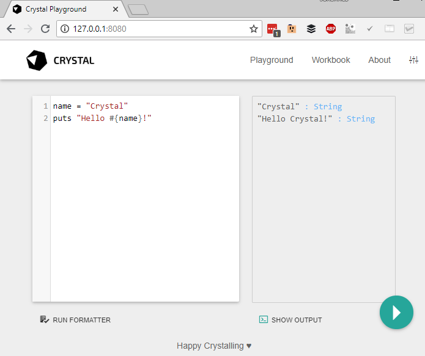

# Using the compiler

## Compiling and running at once

To compile and run a program in a single shot, invoke [`crystal run`](#crystal-run) with a single filename:

```console
$ echo 'puts "Hello World!"' > hello_world.cr
$ crystal run hello_world.cr
Hello World!
```

The `run` command compiles the source file `hello_world.cr` to a binary executable in a temporary location
and immediately executes it.

## Creating an executable

The [`crystal build`](#crystal-build) command builds a binary executable.
The output file has the same name as the source file minus the extension `.cr`.

```console
$ crystal build hello_world.cr
$ ./hello_world
Hello World!
```

### Release builds

By default, the generated executables are not fully optimized. The `--release` flag can be used to enable optimizations.

```console
$ crystal build hello_world.cr --release
```

Compiling without release mode is much faster and the resulting binaries still offer pretty good performance.

Building in release mode should be used for production-ready executables and when performing benchmarks.
For simple development builds, there is usually no reason to do so.

To reduce the binary size for distributable files, the `--no-debug` flag can be used. This removes debug symbols reducing file size, but obviously making debugging more difficult.

### Creating a statically-linked executable

The `--static` flag can be used to build a statically-linked executable:

```console
$ crystal build hello_world.cr --release --static
```

NOTE: Building fully statically linked executables is currently only supported on Alpine Linux.

More information about statically linking [can be found in the Static Linking guide](../../guides/static_linking.md).

The compiler uses the `CRYSTAL_LIBRARY_PATH` environment variable as a first lookup destination for static and dynamic libraries that are to be linked. This can be used to provide static versions of libraries that are also available as dynamic libraries.

### Creating a Crystal project

The [`crystal init`](#crystal-init) command helps to initialize a Crystal project folder, setting
up a basic project structure. `crystal init app <name>` is used for an application,
`crystal init lib <name>` for a library.

```console
$ crystal init app myapp
    create  myapp/.gitignore
    create  myapp/.editorconfig
    create  myapp/LICENSE
    create  myapp/README.md
    create  myapp/shard.yml
    create  myapp/src/myapp.cr
    create  myapp/spec/spec_helper.cr
    create  myapp/spec/myapp_spec.cr
Initialized empty Git repository in /home/crystal/myapp/.git/
```

Not all of these files are required for every project, and some might need more customization, but `crystal init` creates a good default environment for developing Crystal applications and libraries.

## Compiler commands

* [`crystal init`](#crystal-init): generate a new project
* [`crystal build`](#crystal-build): build an executable
* [`crystal docs`](#crystal-docs): generate documentation
* [`crystal env`](#crystal-env): print Crystal environment information
* [`crystal eval`](#crystal-eval): eval code from args or standard input
* [`crystal play`](#crystal-play): starts crystal playground server
* [`crystal run`](#crystal-run): build and run program
* [`crystal spec`](#crystal-spec): build and run specs
* [`crystal tool`](#crystal-tool): run a compiler tool
* [`crystal clear_cache`](#crystal-clear_cache): clear the compiler cache
* `crystal help`: show help about commands and options
* [`crystal version`](#crystal-version): show version

To see the available options for a particular command, use `--help` after a command:

### `crystal run`

The `run` command compiles a source file to a binary executable and immediately runs it.

```
crystal [run] [<options>] <programfile> [-- <argument>...]
```

Arguments to the compiled binary can be separated with double dash `--` from the compiler arguments.
The binary executable is stored in a temporary location between compiling and running.

Example:

```console
$ echo 'puts "Hello #{ARGV[0]?}!"' > hello_world.cr
$ crystal run hello_world.cr -- Crystal
Hello Crystal!
```

**Common options:**

* `-O LEVEL`: Define optimization level: 0 (default), 1, 2, 3. See [Optimizations](#optimizations) for details.
* `--release`: Compile in release mode. Equivalent to `-O3 --single-module`.
* `--progress`: Show progress during compilation.
* `--static`: Link statically.

More options are described in the integrated help: `crystal run --help` or man page `man crystal`.

### `crystal build`

The `crystal build` command builds a dynamically-linked binary executable.

```
crystal build [<options>] <programfile>
```

Unless specified, the resulting binary will have the same name as the source file minus the extension `.cr`.

Example:

```console
$ echo 'puts "Hello #{ARGV[0]?}!"' > hello_world.cr
$ crystal build hello_world.cr
$ ./hello_world Crystal
Hello Crystal!
```

**Common options:**

* `--cross-compile`: Generate a .o file, and print the command to generate an executable to stdout.
* `-D FLAG, --define FLAG`: Define a compile-time flag.
* `-o <output_file>`: Define the name of the binary executable.
* `-O LEVEL`: Define optimization level: 0 (default), 1, 2, 3. See [Optimizations](#optimizations) for details.
* `--release`: Compile in release mode. Equivalent to `-O3 --single-module`.
* `--link-flags FLAGS`: Additional flags to pass to the linker.
* `--no-debug`: Skip any symbolic debug info, reducing the output file size.
* `--progress`: Show progress during compilation.
* `--static`: Link statically.
* `--verbose`: Display executed commands.

More options are described in the integrated help: `crystal build --help` or man page `man crystal`.

### `crystal eval`

The `crystal eval` command reads Crystal source code from command line or stdin, compiles it to a binary executable and immediately runs it.

```
crystal eval [<options>] [<source>]
```

If no `source` argument is provided, the Crystal source is read from standard input. The binary executable is stored in a temporary location between compiling and running.

Example:

```console
$ crystal eval 'puts "Hello World"'
Hello World!
$ echo 'puts "Hello World"' | crystal eval
Hello World!
```

NOTE: When running interactively, stdin can usually be closed by typing the end of transmission character (`Ctrl+D`).

**Common options:**

* `-o <output_file>`: Define the name of the binary executable.
* `-O LEVEL`: Define optimization level: 0 (default), 1, 2, 3. See [Optimizations](#optimizations) for details.
* `--release`: Compile in release mode. Equivalent to `-O3 --single-module`.
* `--no-debug`: Skip any symbolic debug info, reducing the output file size.
* `--progress`: Show progress during compilation.
* `--static`: Link statically.

More options are described in the integrated help: `crystal eval --help` or man page `man crystal`.

### `crystal version`

The `crystal version` command prints the Crystal version, LLVM version and default target triple.

```
crystal version
```

Example:

```console
$ crystal version
--8<-- "crystal-version.txt"
```

### `crystal init`

The `crystal init` command initializes a Crystal project folder.

```
crystal init (lib|app) <name> [<dir>]
```

The first argument is either `lib` or `app`. A `lib` is a reusable library whereas `app` describes
an application not intended to be used as a dependency. A library doesn't have a `shard.lock` file
in its repository and no build target in `shard.yml`, but instructions for using it as a dependency.

Example:

```console
$ crystal init lib my_cool_lib
    create  my_cool_lib/.gitignore
    create  my_cool_lib/.editorconfig
    create  my_cool_lib/LICENSE
    create  my_cool_lib/README.md
    create  my_cool_lib/shard.yml
    create  my_cool_lib/src/my_cool_lib.cr
    create  my_cool_lib/spec/spec_helper.cr
    create  my_cool_lib/spec/my_cool_lib_spec.cr
Initialized empty Git repository in ~/my_cool_lib/.git/
```

### `crystal docs`

The `crystal docs` command generates API documentation from inline docstrings in Crystal files (see [*Documenting Code*](../../syntax_and_semantics/documenting_code.md)).

```bash
crystal docs [--output=<output_dir>] [--canonical-base-url=<url>] [<source_file>...]
```

The command creates a static website in `output_dir` (default `./docs`), consisting of HTML files for each Crystal type,
in a folder structure mirroring the Crystal namespaces. The entrypoint `docs/index.html` can be opened by any web browser.
The entire API docs are also stored as a JSON document in `$output_dir/index.json`.

By default, all Crystal files in `./src` will be appended (i.e. `src/**/*.cr`).
In order to account for load-order dependencies, `source_file` can be used to specify one (or multiple)
entrypoints for the docs generator.

```bash
crystal docs src/my_app.cr
```

**Common options:**

* `--project-name=NAME`: Set the project name. The default value is extracted from `shard.yml` if available. In case no default can be found, this option is mandatory.
* `--project-version=VERSION`: Set the project version. The default value is extracted from current git commit or `shard.yml` if available. In case no default can be found, this option is mandatory.
* `--output=DIR, -o DIR`: Set the output directory (default: `./docs`)
* `--canonical-base-url=URL, -b URL`: Set the [canonical base url](https://en.wikipedia.org/wiki/Canonical_link_element)

For the above example to output the docs at `public` with custom canonical base url, and entrypoint `src/my_app.cr`,
the following arguments can be used:

```bash
crystal docs --output public --canonical-base-url http://example.com/ src/my_app.cr
```

### `crystal env`

The `crystal env` command prints environment variables used by Crystal.

```bash
crystal env [<var>...]
```

By default, it prints information as a shell script. If one or more `var` arguments are provided,
the value of each named variable is printed on its own line.

Example:

```console
$ crystal env
CRYSTAL_CACHE_DIR=/home/crystal/.cache/crystal
CRYSTAL_PATH=lib:/usr/bin/../share/crystal/src
CRYSTAL_VERSION=1.9.0
CRYSTAL_LIBRARY_PATH=/usr/bin/../lib/crystal
CRYSTAL_LIBRARY_RPATH=''
CRYSTAL_OPTS=''
$ crystal env CRYSTAL_VERSION
1.9.0
```

### `crystal spec`

The `crystal spec` command compiles and runs a Crystal spec suite.

```
crystal spec [<options>] [<file>...] [-- [<runner_options>]]
```

All `files` arguments are concatenated into a single Crystal source. If an argument points to a folder, all spec
files inside that folder are appended. If no `files` argument is provided, the default is `./spec`. A filename can be suffixed by `:`
and a line number, providing this location to the `--location` runner option (see below).

Run `crystal spec --options` for available options.

**Runner options:**

`runner_options` are provided to the compiled binary executable which runs the specs. They should be separated from
the other arguments by a double dash (`--`).

* `--verbose`: Prints verbose output, including all example names.
* `--profile`: Prints the 10 slowest specs.
* `--fail-fast`: Abort the spec run on first failure.
* `--junit_output <output_dir>`: Generates JUnit XML output.

The following options can be combined to filter the list of specs to run.

* `--example <name>`: Runs examples whose full nested names include `name`.
* `--line <line>`: Runs examples whose line matches `line`.
* `--location <file>:<line>`: Runs example(s) at `line` in `file` (multiple options allowed).
* `--tag <tag>`: Runs examples with the specified tag, or excludes examples by adding `~` before the tag (multiple options allowed).
    * `--tag a --tag b` will include specs tagged with `a` OR `b`.
    * `--tag ~a --tag ~b` will include specs not tagged with `a` AND not tagged with `b`.
    * `--tag a --tag ~b` will include specs tagged with `a`, but not tagged with `b`

Example:

```console
$ crystal spec
F

Failures:

  1) Myapp works
     Failure/Error: false.should eq(true)

       Expected: true
            got: false

     # spec/myapp_spec.cr:7

Finished in 880 microseconds
1 examples, 1 failures, 0 errors, 0 pending

Failed examples:

crystal spec spec/myapp_spec.cr:6 # Myapp works
```

### `crystal play`

The `crystal play` command starts a webserver serving an interactive Crystal playground.

```
crystal play [--port <port>] [--binding <host>] [--verbose] [file]
```



### `crystal tool`

* `crystal tool context`: Show context for given location
* [`crystal tool dependencies`](#crystal-tool-dependencies): Show tree of required source files
* `crystal tool expand`: Show macro expansion for given location
* [`crystal tool format`](#crystal-tool-format): Format Crystal files
* `crystal tool hierarchy`: Show type hierarchy
* `crystal tool implementations`: Show implementations for given call in location
* `crystal tool types`: Show types of main variables
* [`crystal tool unreachable`](#crystal-tool-unreachable): Show methods that are never called.

### `crystal tool dependencies`

Show tree of required source files.

```
crystal tool dependencies [options] [programfile]
```

Options:

* `-D FLAG`, `--define FLAG`: Define a compile-time flag. This is useful to
  conditionally define types, methods, or commands based on flags available at
  compile time. The default flags are from the target triple given with
  `--target-triple` or the hosts default, if none is given.
* `-f FORMAT`, `--format FORMAT`: Output format `tree` (default), `flat`, `dot`, or `mermaid`.
* `-i PATH`, `--include PATH`: Include path in output.
* `-e PATH`, `--exclude PATH`: Exclude path in output.
* `--verbose`: Show skipped and heads of filtered paths
* `--error-trace`: Show full error trace.
* `-h`, `--help`: Show this message
* `--prelude PATH`: Specify prelude to use. The default one initializes the garbage
  collector. You can also use `--prelude=empty` to use no preludes. This can be
  useful for checking code generation for a specific source code file.
* `-s`, `--stats`: Enable statistics output
* `-p`, `--progress`: Enable progress output
* `-t`, `--time`: Enable execution time output
* `--stdin-filename`: Source file name to be read from STDIN

### `crystal tool format`

The `crystal tool format` command applies default format to Crystal source files.

```
crystal tool format [--check] [<path>...]
```

`path` can be a file or folder name and include all Crystal files in that folder tree. Omitting `path` is equal to
specifying the current working directory.

The formatter also applies to Crystal code blocks in comments (see [*Documenting Code*](../../syntax_and_semantics/documenting_code.md)).

### `crystal tool unreachable`

Show methods that are never called.

```
crystal tool unreachable [options] [programfile]
```

The output is a list of lines with columns separated by tab. The first column is
the location of the def, the second column its reference name and the third
column is the length in lines.

Options:

* `-D FLAG`, `--define FLAG`: Define a compile-time flag
* `-f FORMAT`, `--format FORMAT`: Output format `text` (default) or `json`
* `--error-trace`: Show full error trace
* `-h`, `--help`: Show this message
* `-i PATH`, `--include PATH`: Include path
* `-e PATH`, `--exclude PATH`: Exclude path (default: `lib`)
* `--no-color`: Disable colored output
* `--prelude PATH`: Use given file as prelude
* `-s`, `--stats`: Enable statistics output
* `-p`, `--progress`: Enable progress output
* `-t`, `--time`: Enable execution time output
* `--stdin-filename`: Source file name to be read from STDIN

### `crystal clear_cache`

Clears the compiler cache located at [`CRYSTAL_CACHE_DIR`](#environment-variables).

## Optimizations

The optimization level specifies the codegen effort for producing optimal code.
It's a trade-off between compilation performance (decreasing per optimization level) and runtime performance (increasing per optimization level).

Production builds should usually have the highest optimization level.
Best results are achieved with `--release` which also implies `--single-module`.

* `-O0`: No optimization (default)
* `-O1`: Low optimization
* `-O2`: Middle optimization
* `-O3`: High optimization

## Environment variables

The following environment variables are used by the Crystal compiler if set in the environment. Otherwise the compiler will populate them with default values. Their values can be inspected using [`crystal env`](#crystal-env).

* `CRYSTAL_CACHE_DIR`: Defines path where Crystal caches partial compilation results for faster subsequent builds. This path is also used to temporarily store executables when Crystal programs are run with [`crystal run`](#crystal-run) rather than [`crystal build`](#crystal-build).
  Default value is the first directory that either exists or can be created of `${XDG_CACHE_HOME}/crystal` (if `XDG_CACHE_HOME` is defined), `${HOME}/.cache/crystal`, `${HOME}/.crystal`, `./.crystal`. If `CRYSTAL_CACHE_DIR` is set but points to a path that is not writeable, the default values are used instead.
* `CRYSTAL_PATH`: Defines paths where Crystal searches for required files.
* `CRYSTAL_VERSION` is only available as output of [`crystal env`](#crystal-env). The compiler neither sets nor reads it.
* `CRYSTAL_LIBRARY_PATH`: The compiler uses the paths in this variable as a first lookup destination for static and dynamic libraries that are to be linked. For example, if static libraries are put in `build/libs`, setting the environment variable accordingly will tell the compiler to look for libraries there.

The compiler conforms to [`NO_COLOR`](https://no-color.org/) and turns off ANSI color escapes in the terminal when the environment variable `NO_COLOR` is present (has a value other than the empty string).
