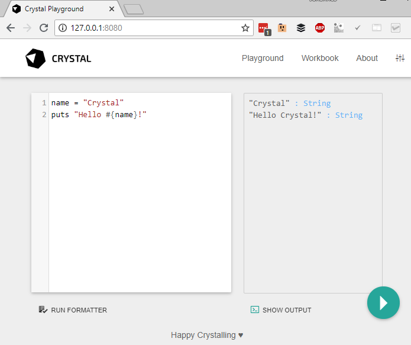

# Using the compiler

Once [installed](../installation/), the Crystal compiler should be available as `crystal` command.

## Compiling and running at once

To compile and run a program in a single shot, invoke [`crystal run`](#crystal-run) with a single filename:

```shell-session
$ echo 'puts "Hello World!"' > hello_world.cr
$ crystal run hello_world.cr
Hello World!
```

The `run` command compiles the source file `hello_world.cr` to a binary executable in a temporary location
and immediately executes it.

## Creating an executable

The [`crystal build`](#crystal-build) command builds a binary executable.
The output file has the same name as the source file minus the extension `.cr`.

```shell-session
$ crystal build hello_world.cr
$ ./hello_world
Hello World!
```

### Release builds

By default, the generated executables are not fully optimized. The `--release` flag can be used to enable optimizations.

```
$ crystal build hello_world.cr --release
```

Compiling without release mode is much faster and the resulting binaries still offer pretty good performance.

Building in release mode should be used for production-ready executables and when performing benchmarks.
For simple development builds, there is usually no reason to do so.

To reduce the binary size for distributable files, the `--no-debug` flag can be used. This removes debug symbols reducing file size, but obviously making debugging more difficult.

### Creating a statically-linked executable

The `--static` flag can be used to build a statically-linked executable:

```
$ crystal build hello_world.cr --release --static
```

**NOTE:** Building statically-linked executables is currently only supported on Alpine Linux.

More information about statically linking [can be found on the wiki](https://github.com/crystal-lang/crystal/wiki/Static-Linking).

### Creating a Crystal project

The [`crystal init`](#crystal-init) command helps to initialize a Crystal project folder, setting
up a basic project structure. `crystal init app <name>` is used for an application,
`crystal init lib <name>` for a library.

```shell
$ crystal init app myapp
    create  myapp/.gitignore
    create  myapp/.editorconfig
    create  myapp/LICENSE
    create  myapp/README.md
    create  myapp/.travis.yml
    create  myapp/shard.yml
    create  myapp/src/myapp.cr
    create  myapp/src/myapp/version.cr
    create  myapp/spec/spec_helper.cr
    create  myapp/spec/myapp_spec.cr
Initialized empty Git repository in /home/crystal/myapp/.git/
```

Not all of these files are required for every project, and some might need more customization, but `crystal init` creates a good default environment for developing Crystal applications and libraries.

## Compiler commands

* [`crystal init`](#crystal-init): generate a new project
* [`crystal build`](#crystal-build): build an executable
* [`crystal docs`](#crystal-docs): generate documentation
* [`crystal env`](#crystal-env): print Crystal environment information
* [`crystal eval`](#crystal-eval): eval code from args or standard input
* [`crystal play`](#crystal-play): starts crystal playground server
* [`crystal run`](#crystal-run): build and run program
* [`crystal spec`](#crystal-spec): build and run specs
* [`crystal tool`](#crystal-tool): run a compiler tool
* `crystal help`: show help about commands and options
* [`crystal version`](#crystal-version): show version

To see the available options for a particular command, use `--help` after a command:

### `crystal run`

The `run` command compiles a source file to a binary executable and immediately runs it.

```
crystal [run] [<options>] <programfile> [-- <argument>...]
```

Arguments to the compiled binary can be separated with double dash `--` from the compiler arguments.
The binary executable is stored in a temporary location between compiling and running.

Example:

```shell-session
$ echo 'puts "Hello #{ARGV[0]?}!"' > hello_world.cr
$ crystal run hello_world.cr -- Crystal
Hello Crystal!
```

**Common options:**

* `--release`: Compile in release mode, doing extra work to apply optimizations to the generated code.
* `--progress`: Show progress during compilation.
* `--static`: Link statically.

More options are described in the integrated help: `crystal run --help` or man page `man crystal`.

### `crystal build`

The `crystal build` command builds a dynamically-linked binary executable.

```
crystal build [<options>] <programfile>
```

Unless specified, the resuling binary will have the same name as the source file minus the extension `.cr`.

Example:

```shell-session
$ echo 'puts "Hello #{ARGV[0]?}!"' > hello_world.cr
$ crystal build hello_world.cr
$ ./hello_world Crystal
Hello Crystal!
```

**Common options:**

* `-o <output_file>`: Define the name of the binary executable.
* `--release`: Compile in release mode, doing extra work to apply optimizations to the generated code.
* `--lto=thin`: Use ThinLTO, improving performance on release builds.
* `--no-debug`: Skip any symbolic debug info, reducing the output file size.
* `--progress`: Show progress during compilation.
* `--static`: Link statically.

More options are described in the integrated help: `crystal build --help` or man page `man crystal`.

### `crystal eval`

The `crystal eval` command reads Crystal source code from command line or stdin, compiles it to a binary executable and immediately runs it.

```
crystal eval [<options>] [<source>]
```

If no `source` argument is provided, the Crystal source is read from standard input. The binary executable is stored in a temporary location between compiling and running.

Example:

```shell-session
$ crystal eval 'puts "Hello World"'
Hello World!
$ echo 'puts "Hello World"' | crystal eval
Hello World!
```

NOTE: When running interactively, stdin can usually be closed by typing the end of transmission character (`Ctrl+D`).

**Common options:**

* `-o <output_file>`: Define the name of the binary executable.
* `--release`: Compile in release mode, doing extra work to apply optimizations to the generated code.
* `--lto=thin`: Use ThinLTO, improves performance.
* `--no-debug`: Skip any symbolic debug info, reducing the output file size.
* `--progress`: Show progress during compilation.
* `--static`: Link statically.

More options are described in the integrated help: `crystal build --help` or man page `man crystal`.

### `crystal version`

The `crystal version` command prints the Crystal version, LLVM version and default target triple.

```
crystal version
```

Example:

```shell-session
$ crystal version
Crystal 0.25.1 [b782738ff] (2018-06-27)

LLVM: 4.0.0
Default target: x86_64-unknown-linux-gnu
```

### `crystal init`

The `crystal init` command initializes a Crystal project folder.

```bash
crystal init (lib|app) <name> [<dir>]
```

The first argument is either `lib` or `app`. A `lib` is a reusable library whereas `app` describes
an application not intended to be used as a dependency. A library doesn't have a `shard.lock` file
in its repository and no build target in `shard.yml`, but instructions for using it as a dependency.

Example:
```shell-session
$ crystal init lib mylib
    create  my_cool_lib/.gitignore
    create  my_cool_lib/.editorconfig
    create  my_cool_lib/LICENSE
    create  my_cool_lib/README.md
    create  my_cool_lib/.travis.yml
    create  my_cool_lib/shard.yml
    create  my_cool_lib/src/my_cool_lib.cr
    create  my_cool_lib/spec/spec_helper.cr
    create  my_cool_lib/spec/my_cool_lib_spec.cr
Initialized empty Git repository in ~/my_cool_lib/.git/
```

### `crystal docs`

The `crystal docs` command generates API documentation from inline docstrings in Crystal files (see [documenting code](../conventions/documenting_code.html)).

```bash
crystal docs [--output=<output_dir>] [--canonical-base-url=<url>] [<source_file>...]
```

The command creates a static website in `output_dir` (default `./docs`), consisting of HTML files for each Crystal type,
in a folder structure mirroring the Crystal namespaces. The entrypoint `docs/index.html` can be opened by any web browser.
The entire API docs are also stored as a JSON document in `$output_dir/index.json`.

By default, all Crystal files in `./src` will be appended (i.e. `src/**/*.cr`).
In order to account for load-order dependencies, `source_file` can be used to specify one (or multiple)
entrypoints for the docs generator.

```bash
crystal docs src/my_app.cr
```

**Common options:**

* `--output=DIR, -o DIR`: Set the output directory (default: `./docs`)
* `--canonical-base-url=URL, -b URL`: Set the [canonical base url](https://en.wikipedia.org/wiki/Canonical_link_element)

For the above example to output the docs at `public` with custom canonical base url, and entrypoint `src/my_app.cr`,
the following arguments can be used:

```bash
crystal docs --output public --canonical-base-url http://example.com/ src/my_app.cr
```

### `crystal env`

The `crystal env` command prints environment variables used by Crystal.

```bash
crystal env [<var>...]
```

By default, it prints information as a shell script. If one or more `var` arguments are provided,
the value of each named variable is printed on its own line.

Example:

```shell-session
$ crystal env
CRYSTAL_CACHE_DIR="/home/crystal/.cache/crystal"
CRYSTAL_PATH="/usr/bin/../share/crystal/src:lib"
CRYSTAL_VERSION="0.25.1"
$ crystal env CRYSTAL_VERSION
0.25.1
```

### `crystal spec`

The `crystal spec` command compiles and runs a Crystal spec suite.

```
crystal spec [<options>] [<file>...] [-- [<runner_options>]]
```

All `files` arguments are concatenated into a single Crystal source. If an argument points to a folder, all spec
files inside that folder are appended. If no `files` argument is provided, the default is `./spec`. A filename can be suffixed by `:`
and a line number, providing this location to the `--location` runner option (see below).

Run `crystal spec --options` for available options.

**Runner options:**

`runner_options` are provided to the compiled binary executable which runs the specs. They should be separated from
the other arguments by a double dash (`--`).

* `--verbose`: Prints verbose output, including all example names.
* `--example <name>`: Runs examples whose full nested names include `name`.
* `--line <line>`: Runs examples whose line matches `line`.
* `--profile`: Prints the 10 slowest specs.
* `--fail-fast`: Abort the spec run on first failure.
* `--location <file>:<line>`: Runs example(s) at `line` in `file` (multiple options allowed).
* `--junit_output <output_dir>`: Generates JUnit XML output.

Example:

```shell-session
$ crystal spec
F

Failures:

  1) Myapp works
     Failure/Error: false.should eq(true)

       Expected: true
            got: false

     # spec/myapp_spec.cr:7

Finished in 880 microseconds
1 examples, 1 failures, 0 errors, 0 pending

Failed examples:

crystal spec spec/myapp_spec.cr:6 # Myapp works
```

### `crystal play`

The `crystal play` command starts a webserver serving an interactive Crystal playground.

```
crystal play [--port <port>] [--binding <host>] [--verbose] [file]
```



### `crystal tool`

* `crystal tool context`: Show context for given location
* `crystal tool expand`: Show macro expansion for given location
* [`crystal tool format`](#crystal-tool-format): Format Crystal files
* `crystal tool hierarchy`: Show type hierarchy
* `crystal tool implementations`: Show implementations for given call in location
* `crystal tool types`: Show types of main variables

### `crystal tool format`

The `crystal tool format` command applies default format to Crystal source files.

```
crystal tool format [--check] [<path>...]
```

`path` can be a file or folder name and include all Crystal files in that folder tree. Omitting `path` is equal to
specifying the current working directory.
